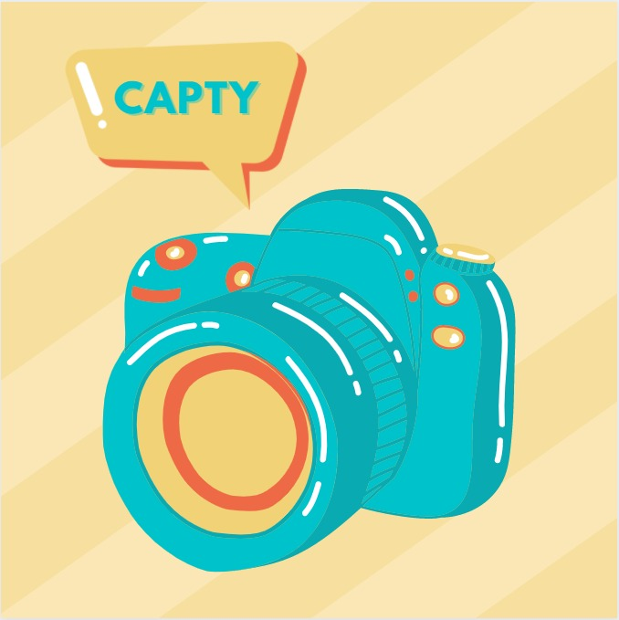

 

  

  <h3 align="center">Capty</h3>

  

    Identify new things smartly!
     
    <a href=""><strong>Download the app! »</strong></a>
     
     
  

## About The Project
      

Aim of our project is to create a ML based Software Application that intelligently identifies
the patterns in the given Image and converts it into a one line description in the form of TEXT.
It Predicts the results on the basis of the patterns it haslearnt during its Training phase.

### Target audience
- Visually Impaired people
- People who have trouble identifying objects or remembering the name

### Unique Selling Point
Never was an app made to help people recognize the scene in front of them. This app focuses on these scenarios:
- Blind people who can't see
- Color blind people who can't recognize color of object in front of them
- People who don't know the object in front of them

### Tech Stack Used

This section should list any major frameworks that you built your project using. Leave any add-ons/plugins for the acknowledgements section. Here are a few examples.
* [Flutter](https://flutter.dev)
* [Firebase](https://firebase.google.com)
* [Flask](https://flask.palletsprojects.com/en/1.1.x/)
* [Keras](https://keras.io)

### Functionalities
- to click a photo and get a caption of what the photo is about

## Packages used

## UI

### Prototype
Figma link:
https://www.figma.com/file/KWxzKBOHzofLo5uhnnAorK/Figma-Mobile-Design?node-id=0%3A1

Prototype link:
https://www.figma.com/proto/KWxzKBOHzofLo5uhnnAorK/Figma-Mobile-Design?node-id=62%3A23&scaling=scale-down&page-id=0%3A1

## .apk file:

## Getting Started

### Installation

👉 Just click on 'Download the app!', and let the application be downloaded itself!

👉 Once it's downloaded, click on 'Open'. 

👉 Then, click on 'Install'. 

👉 Click on 'Install Anyway' and then click on Open.

## Usage

👉 Click a photo of anything, and let the application generate caption for you!

## Future aspects

👉 It has future plans of getting integrated with Google search, and letting you know more information about it.

👉 A helmet with camera can be connected with the app via Bluetooth, enabling visually impaired people to get to know what is the scene in front of them via listening to the caption generated.

👉 Improving accuracy of caption generation.

## 👧 Contributors 👦

<a href="https://github.com/GauravPoosarla" target="_blank"> Gaurav Poosarla  
<a href="https://github.com/AkanshChoudhary" target="_blank"> Akansh Choudhary  
<a href="https://github.com/Margi16" target="_blank"> Margi Bhatt  
<a href="https://github.com/sahilsync07" target="_blank"> Sahil Kumar  
